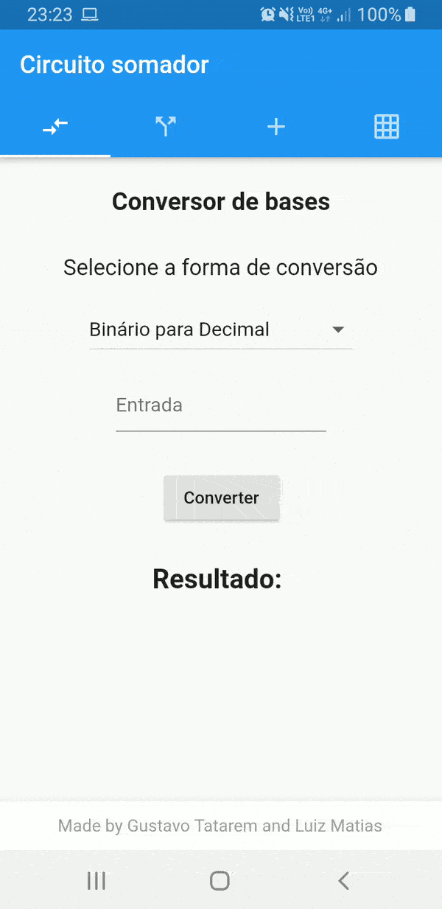

# APP Circuito Somador
#### Universidade Federal do Paraná - UFPR
#### Introdução à Arquitetura de Computadores
#### Curso: Tecnologia em Análise e Desenvolvimento de Sistemas.
#### Alunos: Gustavo Tatarem e Luiz Matias
---

## Como instalar o app

#### Direto no aparelho celular 
 - Faça download do APK disponível no projeto
 - Uma vez terminado o download, abra a área de notificações do celular e clique na notificação de "download concluído" para iniciar o processo de instalação.
> **Nota:** Se você não conseguir iniciar a instalação através das notificações, o APP estará disponível na pasta "Downloads" do gerenciador de arquivos do seu aparelho.
 - Será exibida uma tela com todas as permissões que o aplicativo necessita em seu aparelho, veja todas e logo em seguida clique em "instalar" para iniciar efetivamente a instalação.

#### Utilizando um computador
 - Faça download do APK disponível no projeto
 - Conecte seu aparelho celular via USB ao computador
 - Copie o APK para uma das pastas do gerenciador de arquivos do aparelho
 - No aparelho, abra o gerenciador de arquivos e procure pelo APK na pasta onde ele foi copiado
 - Toque no arquivo de instalação
 - Será exibida uma tela com todas as permissões que o aplicativo necessita em seu aparelho, veja todas e logo em seguida clique em "instalar" para iniciar efetivamente a instalação.

## Sobre o projeto

De acordo com os requisitos do projeto, nossa dupla resolveu desenvolver um app para demonstrar o funcionamento dos seguintes conteúdos:

-   Conversão de bases
-   Portas lógicas
-   Circuito somador

## GIF

